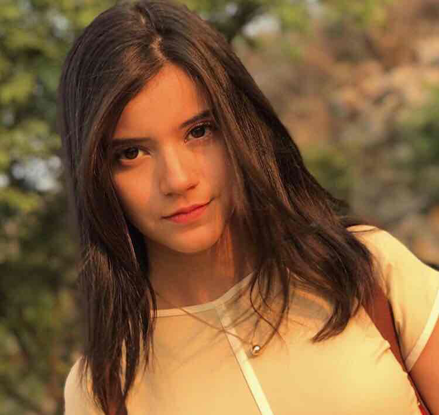
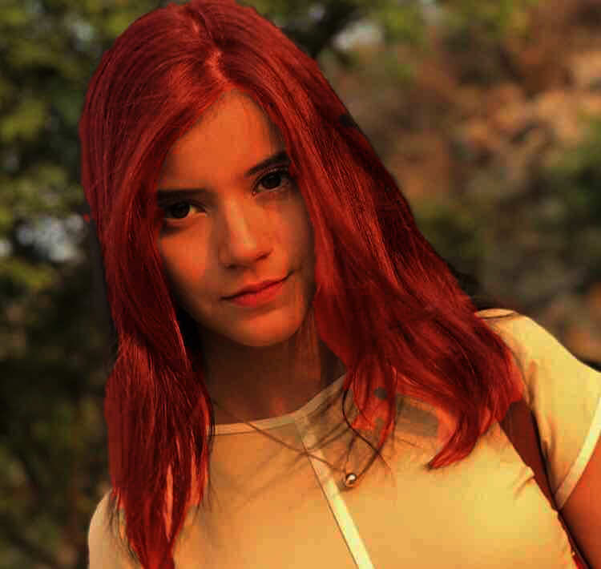

# Deep Dye
DeepDYE is a deep learning model to dye hair un photographs using neural networks.
## How does it works?
1. Process the image with segmentation model based on U-Net to locate the hair area.
2. Color the hair area with the desired color.
3. Merge the images with a soft-light blend mode.

Soft-light blend is powered by [https://github.com/flrs/blend_modes](https://github.com/flrs/blend_modes)

## Installation
1. Clone the repo
```
git clone https://github.com/alcros33/DeepDYE
```
2. Make a virtual env and install the requirements
```
virtualenv .env
source .env/bin/activate
pip install Pillow opencv-python
```
3. Follow the instructions to install Pytorch, then install torchvision and fastai
```
# https://pytorch.org/get-started/locally/
pip install torchvision
pip install fastai
```
4. Download the model and place it inside the folder `Models`

[https://drive.google.com/open?id=10AfHydtWC1rtEyvjyMR9ue02aBsQU5Vv](https://drive.google.com/open?id=10AfHydtWC1rtEyvjyMR9ue02aBsQU5Vv)

##  Usage
```
python DeepDYE.py Image.jpg [red|green|blue|pink] -o ImageOut.png
```

## Example




## Train it yourself

You can train the model yourself by following the steps on the jupyter notebook included in the repo. [HairSeg.ipynb](HairSeg.ipynb)